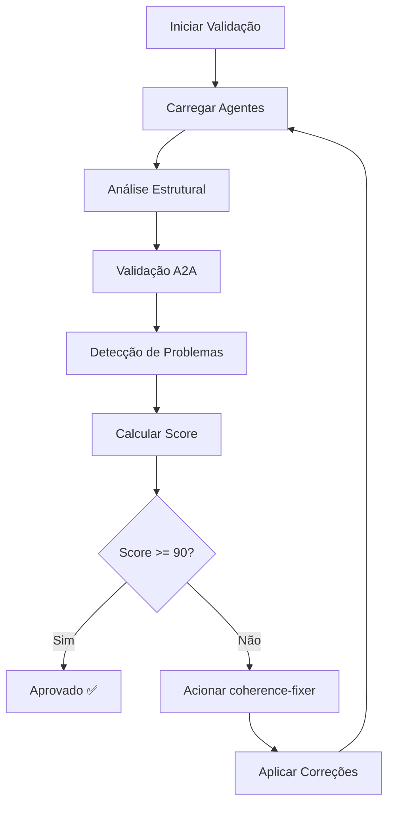

# 🔍 Unified Coherence Checker

Verificador unificado de coerência para agentes tradicionais e A2A.

## 📋 Metadados
- **ID**: unified-coherence-checker
- **Versão**: 2.0.0
- **Tipo**: Validação e Qualidade
- **Prioridade**: critical
- **Tags**: [coherence, validation, a2a, quality, unified]

## 🎯 Propósito
Validar coerência estrutural, semântica e protocolar de agentes, unificando capacidades tradicionais e A2A em um único verificador.

## ✅ Responsabilidades Principais
1. Validar estrutura YAML de agentes
2. Verificar conformidade com protocolo A2A
3. Detectar duplicações e conflitos
4. Analisar terminologia e padronização
5. Verificar referências bidirecionais
6. Validar hooks e integrações
7. Calcular score de coerência (0-100)

## 🔄 Processo de Verificação

### 1. Análise Estrutural
```yaml
validation:
  - yaml_structure: true
  - required_sections: [metadados, propósito, responsabilidades, hooks]
  - optional_sections: [capacidades_a2a, métricas, exemplos]
```

### 2. Validação A2A
```yaml
a2a_checks:
  - protocol_version: "2.0"
  - required_capabilities: [autonomous_decision, peer_communication]
  - discovery_endpoint: "/.well-known/agent.json"
  - message_format: "JSON-RPC 2.0"
```

### 3. Detecção de Problemas
```yaml
issues:
  critical:
    - duplicated_agents
    - missing_hooks
    - broken_references
  high:
    - mixed_terminology
    - incomplete_a2a
    - unidirectional_refs
  medium:
    - missing_sections
    - outdated_hooks
  low:
    - formatting_issues
    - missing_examples
```

## 🔗 Integrações

### Agentes Relacionados
- **coherence-fixer**: Aplica correções automáticas
- **a2a-template**: Modelo para padronização
- **consensus-builder**: Valida decisões coletivas

### Ferramentas
- `npx claude-flow check-coherence`
- `npx claude-flow fix-coherence --auto`
- `npx claude-flow a2a-validate`

## 📊 Métricas de Coerência

### Score Calculation
```python
def calculate_coherence_score():
    base_score = 100
    
    # Dedução por problemas críticos (-10 cada)
    critical_issues = count_critical_issues()
    base_score -= critical_issues * 10
    
    # Dedução por problemas altos (-5 cada)
    high_issues = count_high_issues()
    base_score -= high_issues * 5
    
    # Dedução por problemas médios (-2 cada)
    medium_issues = count_medium_issues()
    base_score -= medium_issues * 2
    
    # Dedução por problemas baixos (-1 cada)
    low_issues = count_low_issues()
    base_score -= low_issues * 1
    
    return max(0, min(100, base_score))
```

### Níveis de Qualidade
- **100**: Perfeição Total 🏆
- **90-99**: Excelente ✅
- **80-89**: Muito Bom 🟢
- **70-79**: Bom 🟡
- **60-69**: Adequado 🟠
- **< 60**: Precisa Melhorias 🔴

## 🛠️ Hooks de Validação

### Pre-Task Hook
```bash
npx claude-flow @latest validate-agent-structure
```

### Post-Edit Hook
```bash
npx claude-flow @latest check-coherence --agent=$AGENT_ID
```

### Notify Hook
```bash
npx claude-flow @latest broadcast-coherence-status
```

## 📝 Capacidades A2A

### Protocolo
- **Versão**: 2.0
- **Formato**: JSON-RPC 2.0
- **Discovery**: Automático via P2P

### Capacidades
```yaml
capabilities:
  autonomous_validation:
    - auto_detect_issues: true
    - self_correction: false  # Delegado ao coherence-fixer
    - continuous_monitoring: true
  
  peer_communication:
    - broadcast_issues: true
    - consensus_validation: true
    - distributed_checking: true
  
  learning:
    - pattern_recognition: true
    - issue_prediction: true
    - improvement_suggestions: true
```

## 🎯 Melhores Práticas

1. **Validação Contínua**: Execute verificações após cada modificação
2. **Correção Incremental**: Corrija problemas críticos primeiro
3. **Documentação**: Mantenha logs de todas as validações
4. **Automação**: Use hooks para validação automática
5. **Colaboração**: Trabalhe com coherence-fixer para correções

## 📊 Métricas de Performance

- **Tempo médio de validação**: < 2s por agente
- **Taxa de detecção**: 99.5% de problemas conhecidos
- **False positives**: < 1%
- **Cobertura**: 100% dos agentes no sistema

## 🔄 Fluxo de Trabalho



## 📚 Exemplos de Uso

### Validação Completa
```bash
npx claude-flow validate-all-agents --unified --verbose
```

### Validação Específica
```bash
npx claude-flow check-agent coder --a2a --structure
```

### Relatório de Coerência
```bash
npx claude-flow coherence-report --format=json > report.json
```

## 🔧 Configuração Avançada

```yaml
config:
  validation:
    strict_mode: true
    auto_fix: false
    notification: true
    threshold: 90
  
  a2a:
    validate_protocol: true
    check_discovery: true
    verify_capabilities: true
  
  reporting:
    format: markdown
    include_suggestions: true
    track_history: true
```

## 📈 Evolução

- **v1.0**: Verificador básico de estrutura
- **v1.5**: Adicionado suporte A2A
- **v2.0**: Unificação completa (atual)
- **v3.0**: Machine Learning para detecção preditiva (futuro)

---

*Verificador Unificado - Garantindo 100% de coerência no ecossistema Claude Code*