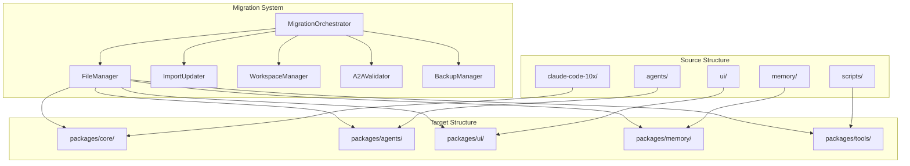
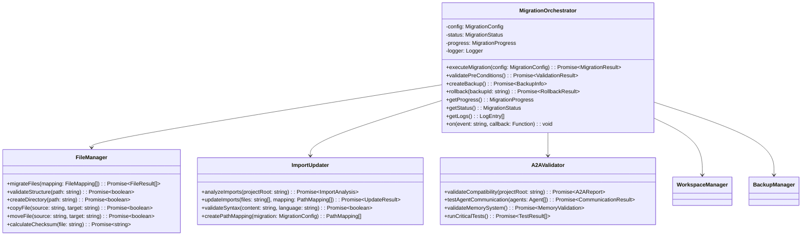
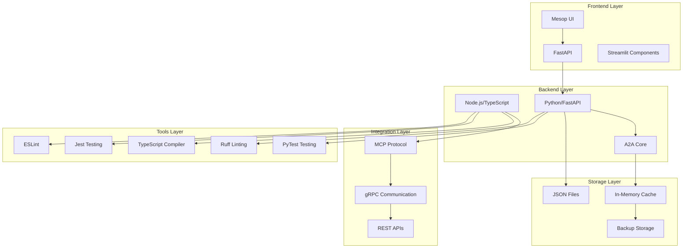
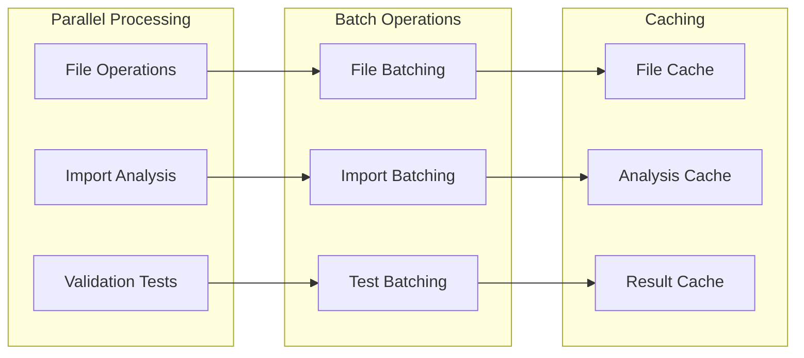

# Component Architecture Diagrams - Claude-20x Reorganization

## System Overview



## MigrationOrchestrator Architecture



## Data Flow Diagram

```
┌─────────────┐    ┌─────────────┐    ┌─────────────┐
│   Source    │    │ Migration   │    │   Target    │
│ Structure   │───▶│  Process    │───▶│ Structure   │
│             │    │             │    │ (packages/) │
└─────────────┘    └─────────────┘    └─────────────┘
       │                  │                  │
       │                  ▼                  │
       │           ┌─────────────┐           │
       │           │   Backup    │           │
       │           │   System    │           │
       │           └─────────────┘           │
       │                  │                  │
       │                  ▼                  │
       │           ┌─────────────┐           │
       │           │    Logs     │           │
       │           │  & Metrics  │           │
       │           └─────────────┘           │
       │                                     │
       └─────────────────────────────────────┘
              (Rollback if needed)
```

## Service Dependencies

```
MigrationOrchestrator
├── FileManager
│   ├── fs (Node.js)
│   ├── path (Node.js)
│   └── BackupManager
├── ImportUpdater
│   ├── @babel/parser
│   ├── @babel/traverse
│   └── @babel/generator
├── WorkspaceManager
│   ├── package.json templates
│   └── workspace configs
├── A2AValidator
│   ├── schema validators
│   └── compatibility checkers
├── BackupManager
│   ├── compression libs
│   └── integrity checkers
└── LoggingService
    ├── Winston
    └── structured logs
```

## Error Handling Flow

```
┌─────────────┐    ┌─────────────┐    ┌─────────────┐
│   Error     │    │   Error     │    │   Recovery  │
│ Detection   │───▶│  Handler    │───▶│  Strategy   │
└─────────────┘    └─────────────┘    └─────────────┘
       │                  │                  │
       │                  ▼                  │
       │           ┌─────────────┐           │
       │           │ Rollback    │           │
       │           │ Manager     │           │
       │           └─────────────┘           │
       │                  │                  │
       │                  ▼                  │
       │           ┌─────────────┐           │
       │           │ Checkpoint  │           │
       │           │ Restore     │           │
       │           └─────────────┘           │
       │                                     │
       └─────────────────────────────────────┘
              (Notify & Log)
```

## Performance Optimization

```
┌─────────────────────────────────────────────────────────────┐
│                  Parallel Processing                        │
│                                                             │
│  ┌─────────────┐  ┌─────────────┐  ┌─────────────┐        │
│  │  Worker 1   │  │  Worker 2   │  │  Worker 3   │        │
│  │ (File Ops)  │  │ (Import     │  │ (Validation)│        │
│  │             │  │  Updates)   │  │             │        │
│  └─────────────┘  └─────────────┘  └─────────────┘        │
│         │                 │                 │              │
│         └─────────────────┼─────────────────┘              │
│                           │                                │
│                           ▼                                │
│                 ┌─────────────────┐                        │
│                 │  Result         │                        │
│                 │  Aggregator     │                        │
│                 └─────────────────┘                        │
└─────────────────────────────────────────────────────────────┘
```

## Technology Stack Architecture



## Performance Optimization

