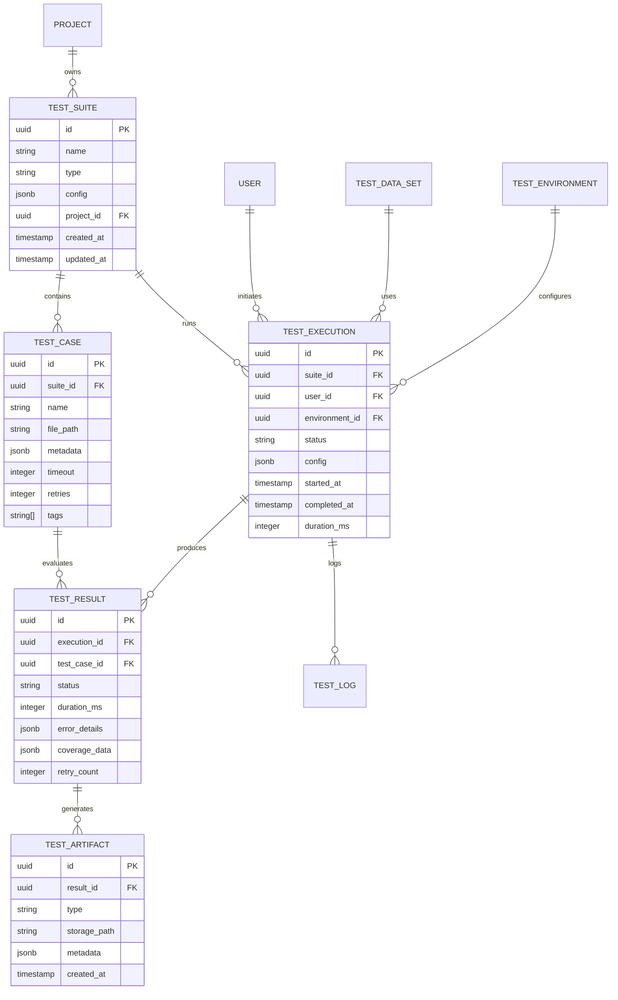

# Data Models and Schemas

## Database Architecture

### Primary Database: PostgreSQL



## Core Data Models

### TestSuite Schema

```typescript
interface TestSuite {
  id: UUID;
  projectId: UUID;
  name: string;
  description?: string;
  type: 'unit' | 'integration' | 'e2e' | 'performance' | 'security';
  
  config: {
    parallel: boolean;
    maxWorkers: number;
    timeout: number;
    retries: number;
    bail: boolean;
    verbose: boolean;
  };
  
  selectors: {
    include?: string[];
    exclude?: string[];
    pattern?: string;
    tags?: string[];
  };
  
  setup?: {
    beforeAll?: string;
    beforeEach?: string;
    afterEach?: string;
    afterAll?: string;
  };
  
  metadata: {
    version: string;
    framework: string;
    language: string;
    dependencies: Record<string, string>;
  };
  
  statistics: {
    totalTests: number;
    avgDuration: number;
    passRate: number;
    lastRun?: Date;
    flakyTests: string[];
  };
  
  createdAt: Date;
  updatedAt: Date;
  createdBy: UUID;
  isActive: boolean;
}
```

### TestCase Schema

```typescript
interface TestCase {
  id: UUID;
  suiteId: UUID;
  name: string;
  description?: string;
  filePath: string;
  lineNumber?: number;
  
  assertions: {
    type: string;
    expected: any;
    actual?: any;
    operator: string;
  }[];
  
  requirements: {
    fixtures?: string[];
    mocks?: string[];
    environment?: Record<string, string>;
    permissions?: string[];
  };
  
  config: {
    timeout: number;
    retries: number;
    skip?: boolean;
    only?: boolean;
    slow?: number;
  };
  
  tags: string[];
  priority: 'critical' | 'high' | 'medium' | 'low';
  
  coverage: {
    lines: number[];
    branches: number[];
    functions: string[];
  };
  
  history: {
    runs: number;
    passes: number;
    failures: number;
    avgDuration: number;
    lastFailure?: Date;
  };
}
```

### TestExecution Schema

```typescript
interface TestExecution {
  id: UUID;
  suiteId: UUID;
  userId: UUID;
  environmentId: UUID;
  
  trigger: {
    type: 'manual' | 'scheduled' | 'ci' | 'webhook';
    source: string;
    metadata?: Record<string, any>;
  };
  
  config: {
    parallel: boolean;
    workers: number;
    timeout: number;
    retries: number;
    dryRun: boolean;
    debug: boolean;
  };
  
  selection: {
    tests: string[];
    tags?: string[];
    pattern?: string;
    changedFiles?: string[];
  };
  
  status: 'queued' | 'preparing' | 'running' | 'completed' | 'failed' | 'cancelled';
  
  progress: {
    total: number;
    completed: number;
    passed: number;
    failed: number;
    skipped: number;
    pending: number;
  };
  
  timing: {
    queuedAt: Date;
    startedAt?: Date;
    completedAt?: Date;
    duration?: number;
  };
  
  resources: {
    cpu: number;
    memory: number;
    containers: number;
    cost?: number;
  };
}
```

### TestResult Schema

```typescript
interface TestResult {
  id: UUID;
  executionId: UUID;
  testCaseId: UUID;
  
  status: 'passed' | 'failed' | 'skipped' | 'pending' | 'broken';
  
  duration: {
    setup: number;
    execution: number;
    teardown: number;
    total: number;
  };
  
  error?: {
    name: string;
    message: string;
    stack: string;
    diff?: {
      expected: any;
      actual: any;
    };
    screenshot?: string;
    video?: string;
  };
  
  retries: {
    count: number;
    attempts: {
      attempt: number;
      status: string;
      duration: number;
      error?: any;
    }[];
  };
  
  coverage?: {
    lines: {
      total: number;
      covered: number;
      percentage: number;
    };
    branches: {
      total: number;
      covered: number;
      percentage: number;
    };
    functions: {
      total: number;
      covered: number;
      percentage: number;
    };
    statements: {
      total: number;
      covered: number;
      percentage: number;
    };
  };
  
  artifacts: {
    logs?: string[];
    screenshots?: string[];
    videos?: string[];
    reports?: string[];
    custom?: Record<string, string>;
  };
  
  metadata: {
    browser?: string;
    os?: string;
    node?: string;
    custom?: Record<string, any>;
  };
}
```

### TestEnvironment Schema

```typescript
interface TestEnvironment {
  id: UUID;
  name: string;
  type: 'local' | 'ci' | 'staging' | 'production';
  
  infrastructure: {
    provider: 'docker' | 'kubernetes' | 'lambda' | 'vm';
    region?: string;
    zone?: string;
    cluster?: string;
  };
  
  services: {
    name: string;
    type: string;
    version: string;
    endpoint: string;
    credentials?: {
      type: 'basic' | 'bearer' | 'apikey' | 'oauth';
      reference: string; // Vault reference
    };
    health?: string;
  }[];
  
  databases: {
    name: string;
    type: 'postgres' | 'mysql' | 'mongodb' | 'redis';
    host: string;
    port: number;
    database: string;
    credentials: string; // Vault reference
    pool?: {
      min: number;
      max: number;
    };
  }[];
  
  variables: Record<string, string>;
  secrets: Record<string, string>; // Vault references
  
  resources: {
    cpu: string;
    memory: string;
    storage: string;
    network: string;
  };
  
  restrictions: {
    maxParallel: number;
    timeout: number;
    rateLimit?: number;
  };
}
```

### TestData Schema

```typescript
interface TestDataSet {
  id: UUID;
  name: string;
  type: 'fixture' | 'seed' | 'generated' | 'snapshot';
  
  schema: {
    version: string;
    entities: {
      name: string;
      count: number;
      template: Record<string, any>;
      relationships?: {
        entity: string;
        type: 'one-to-one' | 'one-to-many' | 'many-to-many';
        field: string;
      }[];
    }[];
  };
  
  data: {
    format: 'json' | 'sql' | 'csv' | 'parquet';
    compression?: 'gzip' | 'brotli' | 'zstd';
    location: string; // S3, GCS, local path
    size: number;
    checksum: string;
  };
  
  generation?: {
    seed?: number;
    locale?: string;
    rules?: Record<string, any>;
    faker?: boolean;
  };
  
  lifecycle: {
    ttl?: number;
    cleanup?: 'immediate' | 'delayed' | 'manual';
    shared?: boolean;
    immutable?: boolean;
  };
  
  usage: {
    count: number;
    lastUsed?: Date;
    suites: string[];
  };
}
```

## Time-Series Data (InfluxDB)

### Test Metrics Schema

```typescript
interface TestMetrics {
  measurement: 'test_execution';
  
  tags: {
    suite_id: string;
    test_id: string;
    environment: string;
    branch: string;
    commit: string;
    user: string;
  };
  
  fields: {
    duration: number;
    memory_usage: number;
    cpu_usage: number;
    network_io: number;
    disk_io: number;
    status: number; // 0=failed, 1=passed
    retries: number;
  };
  
  timestamp: number;
}

interface PerformanceMetrics {
  measurement: 'performance_test';
  
  tags: {
    scenario: string;
    environment: string;
    version: string;
  };
  
  fields: {
    response_time_p50: number;
    response_time_p95: number;
    response_time_p99: number;
    throughput: number;
    error_rate: number;
    concurrent_users: number;
  };
  
  timestamp: number;
}
```

## Document Store (MongoDB)

### Test Logs Collection

```javascript
{
  _id: ObjectId,
  executionId: UUID,
  testId: UUID,
  timestamp: ISODate,
  level: "debug" | "info" | "warn" | "error",
  message: String,
  context: {
    file: String,
    line: Number,
    function: String,
    stack?: String
  },
  metadata: Object,
  correlationId: UUID
}
```

### Test Reports Collection

```javascript
{
  _id: ObjectId,
  executionId: UUID,
  generatedAt: ISODate,
  type: "html" | "json" | "junit" | "allure",
  
  summary: {
    total: Number,
    passed: Number,
    failed: Number,
    skipped: Number,
    duration: Number,
    passRate: Number
  },
  
  details: {
    suites: [{
      name: String,
      tests: Number,
      passed: Number,
      failed: Number,
      duration: Number
    }],
    
    failures: [{
      test: String,
      error: String,
      stack: String,
      diff: Object
    }],
    
    coverage: {
      lines: Number,
      branches: Number,
      functions: Number,
      statements: Number
    }
  },
  
  artifacts: {
    html: String,  // S3 URL
    json: String,  // S3 URL
    screenshots: [String],
    videos: [String]
  },
  
  distribution: {
    recipients: [String],
    channels: ["email", "slack", "teams"],
    sentAt: ISODate
  }
}
```

## Cache Layer (Redis)

### Cache Schemas

```typescript
// Test Result Cache
interface ResultCache {
  key: `result:${executionId}:${testId}`;
  value: {
    status: string;
    duration: number;
    error?: any;
  };
  ttl: 3600; // 1 hour
}

// Test Queue
interface TestQueue {
  key: `queue:${priority}`;
  value: {
    executionId: string;
    suiteId: string;
    tests: string[];
    config: any;
    timestamp: number;
  };
}

// Session Cache
interface SessionCache {
  key: `session:${userId}`;
  value: {
    activeExecutions: string[];
    preferences: any;
    lastActivity: number;
  };
  ttl: 86400; // 24 hours
}

// Lock Management
interface DistributedLock {
  key: `lock:${resource}`;
  value: string; // lock holder ID
  ttl: 30; // 30 seconds
}
```

## Message Queue (RabbitMQ)

### Message Schemas

```typescript
// Test Execution Request
interface ExecutionRequest {
  exchange: 'test.execution';
  routingKey: 'request.new';
  message: {
    id: UUID;
    suiteId: UUID;
    userId: UUID;
    config: any;
    priority: number;
    timestamp: number;
  };
}

// Test Result Event
interface ResultEvent {
  exchange: 'test.results';
  routingKey: `result.${status}`;
  message: {
    executionId: UUID;
    testId: UUID;
    status: string;
    duration: number;
    error?: any;
    artifacts?: string[];
  };
}

// Notification Event
interface NotificationEvent {
  exchange: 'notifications';
  routingKey: `notify.${channel}`;
  message: {
    type: string;
    recipient: string;
    subject: string;
    body: string;
    metadata: any;
  };
}
```

## Data Migrations

### Migration Strategy

```sql
-- Migration: 001_initial_schema.sql
CREATE EXTENSION IF NOT EXISTS "uuid-ossp";

CREATE TABLE test_suites (
    id UUID PRIMARY KEY DEFAULT uuid_generate_v4(),
    project_id UUID NOT NULL,
    name VARCHAR(255) NOT NULL,
    type VARCHAR(50) NOT NULL,
    config JSONB DEFAULT '{}',
    created_at TIMESTAMP DEFAULT CURRENT_TIMESTAMP,
    updated_at TIMESTAMP DEFAULT CURRENT_TIMESTAMP,
    CONSTRAINT unique_suite_name UNIQUE (project_id, name)
);

CREATE INDEX idx_test_suites_project ON test_suites(project_id);
CREATE INDEX idx_test_suites_type ON test_suites(type);

-- Migration: 002_add_test_cases.sql
CREATE TABLE test_cases (
    id UUID PRIMARY KEY DEFAULT uuid_generate_v4(),
    suite_id UUID REFERENCES test_suites(id) ON DELETE CASCADE,
    name VARCHAR(500) NOT NULL,
    file_path TEXT NOT NULL,
    metadata JSONB DEFAULT '{}',
    timeout INTEGER DEFAULT 30000,
    retries INTEGER DEFAULT 0,
    tags TEXT[] DEFAULT '{}',
    created_at TIMESTAMP DEFAULT CURRENT_TIMESTAMP
);

CREATE INDEX idx_test_cases_suite ON test_cases(suite_id);
CREATE INDEX idx_test_cases_tags ON test_cases USING GIN(tags);
```

## Data Retention Policies

```yaml
retention:
  test_executions:
    default: 90d
    failed: 180d
    production: 365d
  
  test_results:
    default: 30d
    failed: 90d
  
  test_artifacts:
    screenshots: 7d
    videos: 14d
    logs: 30d
  
  test_metrics:
    raw: 7d
    aggregated_hourly: 30d
    aggregated_daily: 365d
```