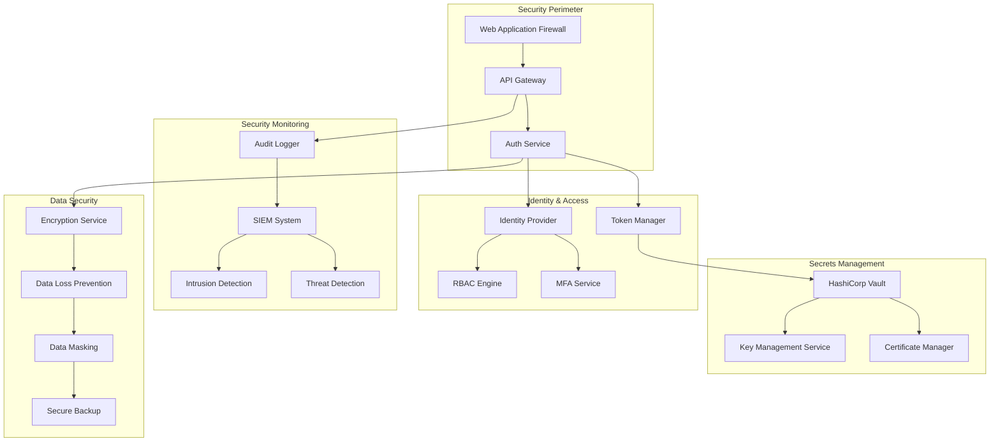
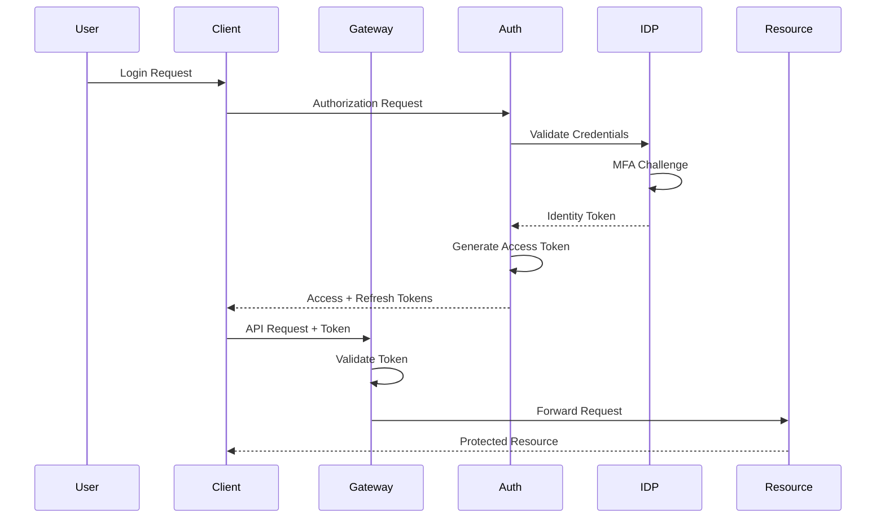

# Security Architecture

## Security Overview



## Authentication Architecture

### OAuth 2.0 / OpenID Connect Flow



### JWT Token Structure

```json
{
  "header": {
    "alg": "RS256",
    "typ": "JWT",
    "kid": "key-id-123"
  },
  "payload": {
    "sub": "user-uuid",
    "iss": "https://auth.test-system.com",
    "aud": "test-system-api",
    "exp": 1640995200,
    "iat": 1640991600,
    "jti": "token-uuid",
    "scope": "read:tests write:tests execute:tests",
    "permissions": [
      "test.execute",
      "test.view",
      "report.generate"
    ],
    "roles": ["developer", "tester"],
    "tenant": "tenant-uuid",
    "session": "session-uuid"
  },
  "signature": "..."
}
```

### API Key Management

```typescript
interface APIKey {
  id: UUID;
  name: string;
  key: string; // Hashed
  prefix: string; // Visible prefix for identification
  
  permissions: {
    scopes: string[];
    resources: string[];
    rateLimit: number;
    ipWhitelist?: string[];
  };
  
  metadata: {
    createdBy: UUID;
    createdAt: Date;
    lastUsed?: Date;
    expiresAt?: Date;
    rotateAt: Date;
  };
  
  security: {
    algorithm: 'hmac-sha256' | 'ed25519';
    salt: string;
    iterations: number;
  };
  
  audit: {
    usageCount: number;
    lastIP?: string;
    lastUserAgent?: string;
    suspiciousActivity: boolean;
  };
}
```

## Authorization Architecture

### Role-Based Access Control (RBAC)

```yaml
roles:
  admin:
    description: Full system access
    permissions:
      - "*"
    
  test_manager:
    description: Manage test suites and executions
    permissions:
      - test.create
      - test.update
      - test.delete
      - test.execute
      - test.view
      - report.generate
      - report.view
    
  developer:
    description: Execute and view tests
    permissions:
      - test.execute
      - test.view
      - report.view
      - data.generate
    
  viewer:
    description: Read-only access
    permissions:
      - test.view
      - report.view

permissions:
  test.create:
    resource: /tests/*
    actions: [POST]
    
  test.execute:
    resource: /tests/execute
    actions: [POST]
    conditions:
      - rateLimit: 100/hour
      - environment: [dev, staging]
    
  report.generate:
    resource: /reports/*
    actions: [POST]
    conditions:
      - format: [html, json, pdf]
```

### Attribute-Based Access Control (ABAC)

```typescript
interface AccessPolicy {
  id: UUID;
  name: string;
  effect: 'allow' | 'deny';
  
  principal: {
    type: 'user' | 'group' | 'service';
    attributes: {
      role?: string[];
      department?: string;
      clearanceLevel?: number;
      location?: string;
    };
  };
  
  resource: {
    type: string;
    attributes: {
      classification?: 'public' | 'internal' | 'confidential' | 'secret';
      owner?: string;
      project?: string;
      environment?: string;
    };
  };
  
  action: string[];
  
  conditions: {
    timeWindow?: {
      start: string;
      end: string;
      timezone: string;
    };
    ipRange?: string[];
    mfaRequired?: boolean;
    riskScore?: {
      max: number;
    };
  };
}
```

## Encryption & Key Management

### Encryption Strategy

```yaml
encryption:
  at_rest:
    algorithm: AES-256-GCM
    key_rotation: 90_days
    
    databases:
      transparent_encryption: true
      column_encryption:
        - users.ssn
        - users.credit_card
        - test_data.pii
    
    files:
      storage: S3
      server_side_encryption: AES256
      customer_managed_keys: true
    
  in_transit:
    tls_version: "1.3"
    cipher_suites:
      - TLS_AES_256_GCM_SHA384
      - TLS_CHACHA20_POLY1305_SHA256
    certificate_validation: strict
    mutual_tls: 
      enabled: true
      required_for: [production]
    
  key_management:
    provider: HashiCorp Vault
    key_hierarchy:
      master: HSM
      data_encryption: KMS
      field_level: Application
    rotation:
      automatic: true
      frequency: 90_days
      grace_period: 30_days
```

### Secrets Management

```typescript
interface SecretManagement {
  vault: {
    url: string;
    namespace: string;
    auth: {
      method: 'kubernetes' | 'aws' | 'token';
      role: string;
    };
  };
  
  secrets: {
    path: string;
    type: 'kv' | 'database' | 'ssh' | 'pki';
    version?: number;
    ttl?: number;
    renewable?: boolean;
  }[];
  
  rotation: {
    enabled: boolean;
    schedule: string; // Cron expression
    handlers: {
      database: 'rotate-db-password';
      api: 'rotate-api-key';
      certificate: 'renew-certificate';
    };
  };
  
  leasing: {
    enabled: boolean;
    default_ttl: number;
    max_ttl: number;
    revoke_on_delete: boolean;
  };
}
```

## Security Monitoring

### Threat Detection

```typescript
interface ThreatDetection {
  rules: {
    id: string;
    name: string;
    severity: 'low' | 'medium' | 'high' | 'critical';
    
    conditions: {
      failed_logins: {
        threshold: number;
        window: number;
      };
      
      rate_limiting: {
        requests_per_second: number;
        burst_size: number;
      };
      
      anomaly_detection: {
        baseline_window: number;
        deviation_threshold: number;
      };
      
      geo_blocking: {
        blocked_countries: string[];
        suspicious_locations: boolean;
      };
    };
    
    actions: {
      alert: boolean;
      block: boolean;
      challenge: 'captcha' | 'mfa';
      quarantine: boolean;
    };
  }[];
  
  ml_models: {
    user_behavior: {
      enabled: boolean;
      training_window: number;
      update_frequency: string;
    };
    
    api_patterns: {
      enabled: boolean;
      anomaly_threshold: number;
    };
  };
}
```

### Audit Logging

```yaml
audit:
  events:
    authentication:
      - login_success
      - login_failure
      - logout
      - password_change
      - mfa_enrollment
    
    authorization:
      - permission_granted
      - permission_denied
      - role_assigned
      - role_revoked
    
    data_access:
      - test_executed
      - report_generated
      - data_exported
      - pii_accessed
    
    administration:
      - user_created
      - user_deleted
      - config_changed
      - secret_accessed
  
  format:
    type: structured
    schema: JSON
    fields:
      - timestamp
      - event_type
      - user_id
      - session_id
      - ip_address
      - user_agent
      - resource
      - action
      - result
      - metadata
  
  storage:
    destination: SIEM
    retention: 365_days
    immutable: true
    encryption: required
```

## Compliance & Governance

### GDPR Compliance

```typescript
interface GDPRCompliance {
  data_privacy: {
    purpose_limitation: string[];
    data_minimization: boolean;
    consent_management: {
      explicit: boolean;
      withdrawable: boolean;
      granular: boolean;
    };
  };
  
  data_subject_rights: {
    access: {
      enabled: boolean;
      response_time: '30_days';
    };
    rectification: {
      enabled: boolean;
      audit_trail: boolean;
    };
    erasure: {
      enabled: boolean;
      cascade_delete: boolean;
      retention_override: string[];
    };
    portability: {
      enabled: boolean;
      formats: ['json', 'csv'];
    };
  };
  
  breach_notification: {
    authority_notification: '72_hours';
    user_notification: 'without_undue_delay';
    documentation: boolean;
  };
  
  privacy_by_design: {
    data_protection_impact_assessment: boolean;
    pseudonymization: boolean;
    encryption_by_default: boolean;
  };
}
```

### Security Policies

```yaml
security_policies:
  password_policy:
    min_length: 12
    complexity:
      uppercase: true
      lowercase: true
      numbers: true
      special_chars: true
    history: 5
    expiry: 90_days
    lockout:
      attempts: 5
      duration: 30_minutes
  
  session_policy:
    timeout: 
      idle: 30_minutes
      absolute: 8_hours
    concurrent_sessions: 3
    secure_cookie: true
    same_site: strict
  
  api_security:
    rate_limiting:
      default: 1000/hour
      authenticated: 5000/hour
      premium: 10000/hour
    cors:
      allowed_origins: ["https://*.test-system.com"]
      allowed_methods: ["GET", "POST", "PUT", "DELETE"]
      max_age: 86400
    csrf:
      enabled: true
      token_validation: double_submit
  
  network_security:
    ip_whitelist:
      admin: ["10.0.0.0/8"]
      api: ["0.0.0.0/0"]
    firewall_rules:
      inbound: 
        - port: 443
          protocol: HTTPS
          source: "0.0.0.0/0"
      outbound:
        - destination: "vault.internal"
          port: 8200
```

## Vulnerability Management

### Security Scanning

```yaml
scanning:
  static_analysis:
    tools:
      - SonarQube
      - Checkmarx
      - Veracode
    frequency: every_commit
    blocking: true
    severity_threshold: high
  
  dynamic_analysis:
    tools:
      - OWASP ZAP
      - Burp Suite
    frequency: nightly
    environments: [staging]
  
  dependency_scanning:
    tools:
      - Snyk
      - WhiteSource
      - Dependabot
    frequency: daily
    auto_update: 
      patches: true
      minor: false
      major: false
  
  container_scanning:
    tools:
      - Trivy
      - Clair
      - Anchore
    frequency: every_build
    base_image_policy:
      allowed: ["alpine", "distroless"]
      max_age: 30_days
  
  infrastructure_scanning:
    tools:
      - Terraform Sentinel
      - Cloud Custodian
      - AWS Config
    frequency: continuous
    compliance_frameworks:
      - CIS
      - PCI-DSS
      - HIPAA
```

## Incident Response

### Incident Response Plan

```yaml
incident_response:
  severity_levels:
    critical:
      description: Data breach or system compromise
      response_time: 15_minutes
      escalation: immediate
      team: [security, leadership, legal]
    
    high:
      description: Potential security threat
      response_time: 1_hour
      escalation: 2_hours
      team: [security, ops]
    
    medium:
      description: Security anomaly detected
      response_time: 4_hours
      escalation: 8_hours
      team: [security]
    
    low:
      description: Minor security event
      response_time: 24_hours
      escalation: 48_hours
      team: [ops]
  
  playbooks:
    data_breach:
      - isolate_affected_systems
      - preserve_evidence
      - assess_impact
      - notify_stakeholders
      - implement_containment
      - eradicate_threat
      - recover_systems
      - post_incident_review
    
    ddos_attack:
      - enable_ddos_protection
      - increase_rate_limiting
      - scale_infrastructure
      - block_malicious_ips
      - notify_cdn_provider
    
    credential_compromise:
      - force_password_reset
      - revoke_sessions
      - audit_access_logs
      - enable_mfa
      - notify_affected_users
```